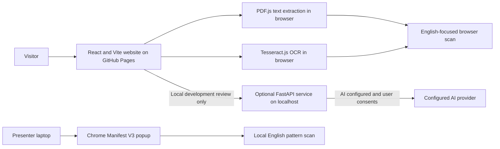

# Anugya Satyapak

**Understand the terms before you agree.**

Anugya Satyapak is a hackathon prototype that helps people take a first look at contracts and terms of service. It highlights selected wording that may deserve attention, shows the supporting passage, and suggests what a reader could check next.

[Open the website](https://0blisake.github.io/Anugya-Satyapak/) · [View this repository](https://github.com/0blisake/Anugya-Satyapak) · [Report a problem](https://github.com/0blisake/Anugya-Satyapak/issues)

> **Prototype notice:** This is an issue-spotting aid, not legal advice or a legal decision system. It can miss important terms, misread context, or show incomplete references. A report with no findings does not prove that an agreement is safe.

## For readers and demo users

### What you can try

On the [website](https://0blisake.github.io/Anugya-Satyapak/), paste contract text or upload a text file, PDF, scanned PDF, or screenshots. The site extracts text in your browser, lets you correct the extracted text, and then produces a first-pass report. The report can be downloaded as text or printed to PDF.

For screenshots, select images in page order. The prototype accepts up to 10 screenshots per batch. Scanned PDFs and photos use OCR; selectable text in digital PDFs is extracted directly. OCR may make mistakes, so compare the extracted wording with the original before relying on a finding.

### What happens to the contract text

The public GitHub Pages website processes pasted text, uploaded files, and OCR in your browser. It does not send contract content to an Anugya Satyapak review server. On the first OCR use, your browser downloads the OCR engine and English/Hindi language data from public CDNs; the contract file and recognized text are not uploaded to those CDNs.

The public website uses a limited, English-focused wording scan. The optional AI-assisted flow is available only when a developer runs the local API, configures an AI provider, and the user consents. In that flow, corrected text is sent to the local API and then to the configured provider. Provider usage may cost money and is subject to that provider’s terms.

### What the results mean

Treat a highlighted passage as a prompt to read more of the agreement. The browser scan checks a small set of English patterns. It may miss indirect or unusual wording and may flag harmless wording. The optional AI review can also make mistakes. References come from a small source list, not a complete or legally reviewed database of Indian law. Neither path decides whether a clause is fair, unlawful, enforceable, or safe.

The website has English and Hindi interface options and can use English/Hindi OCR. The wording scan is English-focused, and Hindi AI output has not been manually evaluated. Lawyer referrals and direct contact options are placeholders in this prototype.

### Local Chrome extension showcase

The Chrome extension is for a project-team laptop demo. It is loaded unpacked in desktop Chrome and is not published in the Chrome Web Store. It runs a short English wording scan locally, without a backend, API key, or npm setup. Follow the [extension setup guide](extension/README.md). The extension is for quick checks; use the website for files, OCR, text correction, citations, and the fuller report.

For questions or feedback, use [GitHub Issues](https://github.com/0blisake/Anugya-Satyapak/issues). Please do not post contracts, personal information, or other sensitive content in a public issue.

---

## Technical guide for contributors

### Architecture



The deployed website is static and has no hosted review API. Its uploads are handled by browser-side PDF.js and Tesseract.js, then the browser-based pattern scan. In local development, Vite can proxy `/api` requests to the optional FastAPI service at `127.0.0.1:8000`. AI is available only when configured on that local API and requires consent for each review. The extension packages its own local rules and does not send captured text to a server.

### Run the website locally

**Requirements:** Node.js 20.19+ (or 22.12+) and npm. Internet access is needed to install dependencies and for the first OCR use.

```powershell
git clone https://github.com/0blisake/Anugya-Satyapak.git
cd Anugya-Satyapak/frontend
npm ci --ignore-scripts
npm run dev
```

Open the local URL printed by Vite, normally [http://localhost:5173](http://localhost:5173). You do not need Python, a backend, an API key, or a Tesseract installation to use the browser-based upload and rules scan.

### Optional local AI API

**Requirements:** Python 3.10+ and the frontend setup above. The API is optional; the local website works without it.

In a second PowerShell window, from the repository root:

```powershell
cd backend
python -m venv .venv
.\.venv\Scripts\python.exe -m pip install -r requirements.txt
Copy-Item .env.example .env
```

Edit `backend/.env` only if you want to enable AI. Add an API key and a model enabled for your account. The model value in `.env.example` is a sample and may not be available to every account. Then, from the `backend/` directory, start the service:

```powershell
.\.venv\Scripts\python.exe -m uvicorn app.main:app --port 8000
```

The local Vite server proxies `/api` to this service. Without AI credentials, the API uses its rules-based prototype mode. With AI configured, the site asks for consent before sending corrected text to the API and provider. API usage may incur charges. Never put a provider key in frontend files, GitHub Pages configuration, the extension, or Git.

The website’s upload flow continues to extract files in the browser; it does not depend on the API’s separate extraction endpoint. The backend OCR endpoint has its own Tesseract system dependency.

### Repository map

| Path | Contents |
|---|---|
| `frontend/` | React, TypeScript, Vite website; browser PDF extraction, OCR, review UI, and report |
| `backend/app/` | Optional FastAPI analysis and extraction endpoints; AI adapter and rules fallback |
| `backend/data/` | Small curated seed of legal references |
| `backend/examples/` | Fictional AI-review evaluation examples; not an automated test suite |
| `extension/` | Local Chrome extension source and its setup guide |
| `docs/` | Project scope, AI pipeline notes, visual design notes, and extension design record |
| `.github/workflows/deploy-pages.yml` | GitHub Actions build and GitHub Pages deployment |

### Deployment and further reading

The GitHub Actions workflow builds `frontend/` and deploys the resulting static site to GitHub Pages on pushes to `main`; it can also be run manually. The workflow does not deploy the optional backend or configure AI credentials.

- [Project scope and implementation cross-check](docs/project-scope.md)
- [AI pipeline and open evaluation gaps](docs/ai-pipeline.md)
- [Visual design and brand assets](docs/visual-design.md)
- [Extension behavior and permissions](docs/extension.md)
- [Technical flowcharts and presentation guide](docs/technical-flow.md)
- [Brand logo instructions](frontend/public/brand/README.md)
- [Extension privacy notice](https://0blisake.github.io/Anugya-Satyapak/extension-privacy.html)

### License

There is no `LICENSE` file in this repository. The source is available to inspect, but reuse is not granted by a license at this time.
