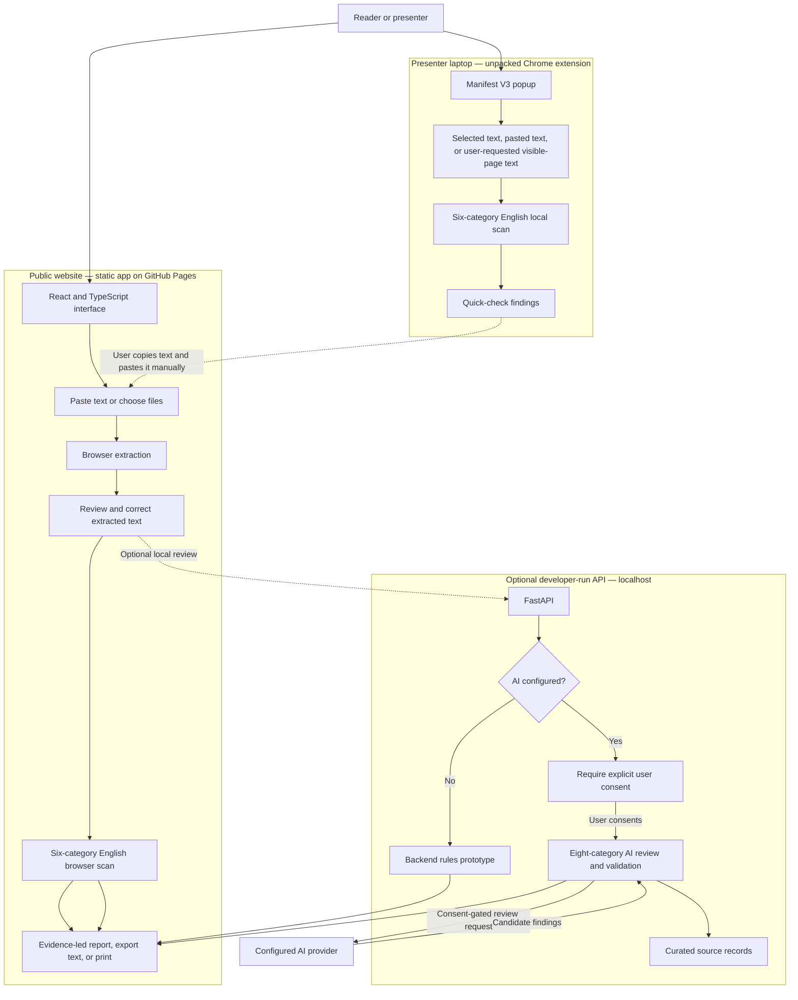
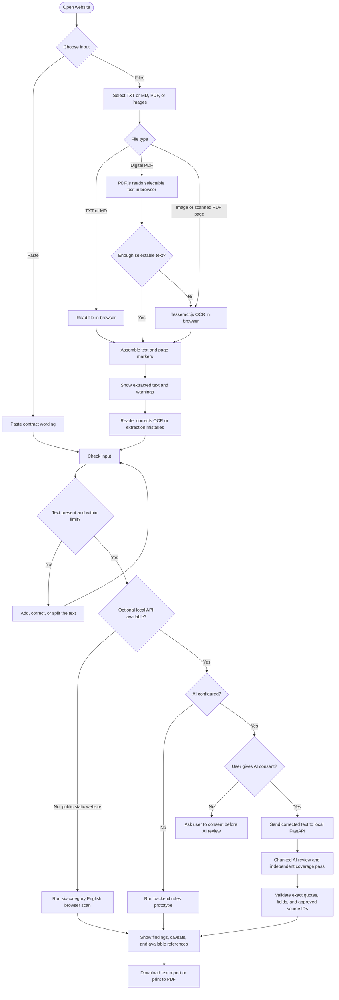
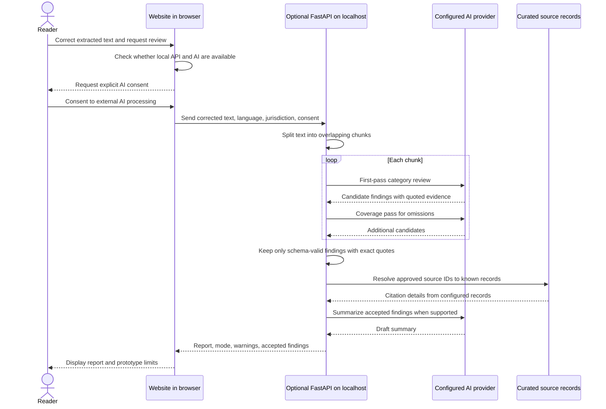
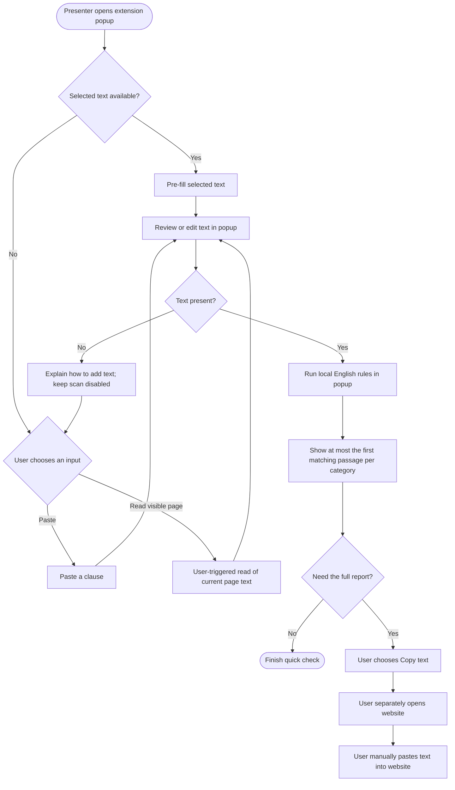
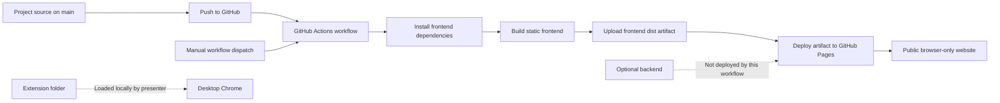

# Anugya Satyapak — technical flow and presentation guide

This document maps the prototype from user input to report, explains the data boundaries, and gives a short version suitable for a hackathon presentation. It describes the current implementation, including its prototype limits.

## 1. System map

**Reading the map:** the public website is a static browser app; the API is an optional local development service and is not hosted with the public site. The extension is a separate laptop showcase. It does not silently send its text to the website: the person must choose to copy, open the site, and paste.

## 2. Website: input to report

### Website behavior details

- Text files are read directly in the browser. Digital PDFs use PDF.js to read selectable text. Scanned PDF pages and photos use Tesseract.js in the browser. If a PDF page has very little selectable text, the page is rendered and OCR is attempted.
- OCR/extraction output is shown for correction before review. The site can process up to 10 screenshots per batch, 12 MB per file, 30 MB total, and 30 PDF pages. OCR may misread text; the user should compare it with the original.
- The public GitHub Pages version runs the browser-based, six-category English wording scan. File contents and recognized text stay in that browser; on first OCR use, the browser downloads the OCR engine and language data from public CDNs.
- During local development, Vite can connect the frontend to the optional FastAPI service at `127.0.0.1:8000`. If the API is available but AI is not configured, it reports the backend rules prototype. When AI is configured, the user must consent before the corrected text is submitted for AI review.
- The AI pipeline works over text chunks, requests an initial review and a coverage pass, then validates candidate findings. It keeps a candidate only when the quoted evidence appears exactly in the chunk reviewed and checks source IDs against the configured curated source records. These checks do not establish that a legal interpretation is correct.
- The optional backend also contains file-extraction endpoints, but the website's current file flow uses browser extraction. Backend OCR has a separate Tesseract installation requirement.
- Reports identify whether they came from the browser rules scan, backend rules scan, or AI-assisted prototype. They are issue-spotting output, not legal conclusions. A report with no findings does not show that a contract is safe.

## 3. Optional AI path and privacy boundary

AI is optional, configured by the project owner on the API server, and can incur provider charges. The public Pages deployment does not include this API or an API key. If AI is enabled locally, corrected contract text leaves the browser for the local API and is sent onward to the configured provider only after explicit consent. Do not describe `store: false` as a guarantee about all provider or hosting retention practices.

## 4. Chrome extension: quick check

The extension requests `activeTab`, `scripting`, and `clipboardWrite`. It has no persistent site access, backend/API connection, AI, text storage, OCR, citations, or full report. Its popup scans up to 40,000 characters against six English categories. Results are a quick prompt to inspect wording. The extension is loaded unpacked in desktop Chrome on a presenter laptop; it is not a Chrome Web Store product.

## 5. Build and deployment flow

The Pages workflow builds only `frontend/` and publishes `frontend/dist`. It does not deploy the FastAPI service, configure a provider key, or publish the extension. The extension showcase is installed from the repository's `extension/` folder using Chrome Developer mode and **Load unpacked**.

## 6. What the prototype does and does not claim

**It does:** help a reader extract or paste text, correct it, and notice selected wording patterns; optionally offer an owner-configured AI-assisted first pass with quote and source checks; provide a separate local quick-check extension for a presenter.

**It does not:** guarantee detection of every term, establish legal fairness or enforceability, provide a complete legal-source database, replace a lawyer, or prove safety when it finds nothing. The browser scan is English-focused. Hindi OCR and interface text exist, but Hindi review quality has not been evaluated. AI quality, false-positive rate, recall, and live provider behavior have not been established.

## 7. Presentation version

### 30-second explanation

> Anugya Satyapak is a contract issue-spotting prototype. On the website, a reader can paste text or upload a PDF or screenshots. Text extraction and OCR run in the browser, and the reader can correct the result before checking it. The public version uses a small English pattern scan. An optional local API can add a consent-gated AI review. A separate Chrome popup gives presenters a quick local check on selected webpage text. We show evidence and limitations, and we do not present the result as legal advice.

### 60-second technical walkthrough

1. **Input:** “I paste contract text or choose a PDF, text file, or screenshots.”
2. **Extraction:** “PDF.js reads selectable PDF text. Tesseract.js reads photos and scanned pages in the browser.”
3. **Human correction:** “We show the extracted text first because OCR can be wrong; the user can correct it before analysis.”
4. **Analysis choices:** “The public site runs six English pattern categories locally. In a developer-run setup, an optional FastAPI service can use backend rules or, when configured and approved by the user, a two-pass AI review.”
5. **Evidence and report:** “AI candidates need an exact supporting quote and an approved source ID before they are included. The report shows its mode and caveats; findings are prompts to investigate, not legal verdicts.”
6. **Extension:** “The Chrome popup is a local quick check. It reads selected text or text the user explicitly asks it to read, scans locally, and only hands off to the site if the user copies and pastes.”
7. **Deployment:** “GitHub Actions publishes the static frontend to GitHub Pages. The optional API and presenter-installed extension are separate.”

### Suggested live demo order

1. Open the public website and show the paste/upload choices.
2. Use a prepared, fictional contract example; avoid real personal or confidential contracts.
3. Demonstrate correction of one deliberately imperfect OCR phrase, or use pre-extracted text if OCR setup/network is unreliable.
4. Run the scan and point to the quoted passage, category, and limitation notice.
5. Open the extension on a prepared contract webpage, show selection capture, and run its local quick check.
6. Explain the optional AI path and its consent/data boundary without implying it is enabled on the public Pages site.

## 8. Questions judges may ask

| Question | Accurate short answer |
|---|---|
| Does the public website send contracts to a server? | No. The public static version extracts and scans in the browser. The optional AI path exists only when an owner runs and configures the API, and it asks for consent before sending corrected text to the configured provider. |
| Does it catch every hidden or unfair clause? | No. The browser scan is limited, and even AI can miss or misunderstand context. It is a first-pass issue-spotting aid. |
| Why include OCR correction? | OCR can change words or miss a line. Letting a person inspect and correct the extracted text reduces avoidable analysis errors. |
| Why two interfaces? | The website is the full workspace for files, correction, and reports. The extension is a smaller, user-triggered quick check while browsing. |
| Is the extension published publicly? | No. It is loaded unpacked in desktop Chrome for a project-team laptop showcase. |
| Is the AI feature running on the public site? | No. Public GitHub Pages serves the static browser app. AI requires a separately run API, a configured provider, and user consent. |
| Is the citation list complete legal authority? | No. It is a small curated source set and has not been legally validated as comprehensive. |
